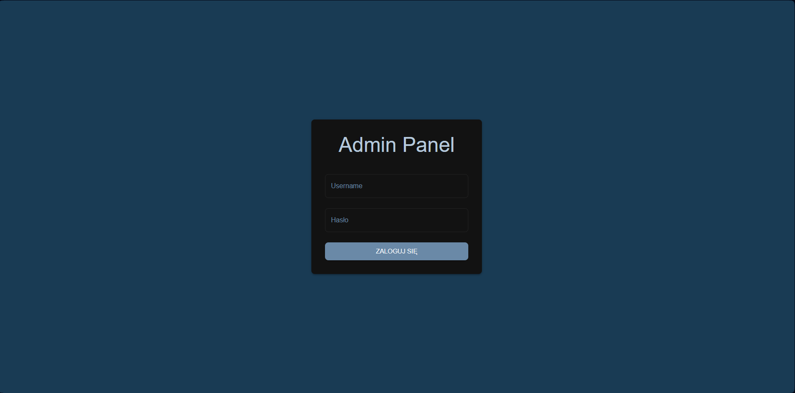
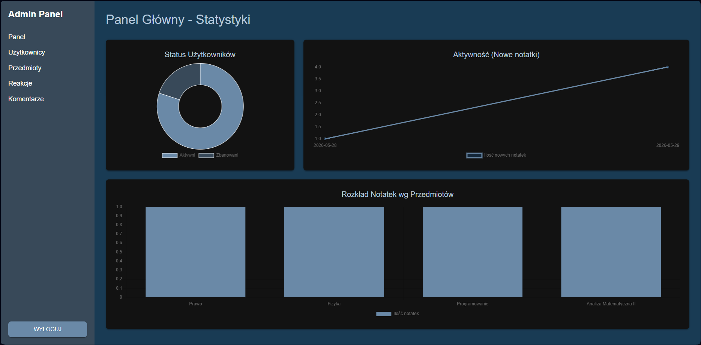

# SimpleNote - Admin Dashboard

A comprehensive admin dashboard for the SimpleNote system, built as a Single Page Application (SPA). This tool provides full management capabilities for the application ecosystem, ranging from user and comment moderation to real-time activity statistics analysis.

* **Rock-Solid Authentication:** JWT-based security implementation using a short-lived `Access Token` in memory/localStorage and a long-lived `Refresh Token` in an HttpOnly cookie. Survives page refreshes (F5) seamlessly!
* **Interactive Dashboard:** Data aggregation (e.g., note creation over time, subject distribution, account statuses) visualized with responsive Chart.js graphs.
* **User Management:** Profile preview and account ban/unban mechanisms accessible from a clean, intuitive data table.
* **Content Moderation (Comments & Reactions):** Display comments with a soft-delete option for parent comments and all their replies. Full CRUD system for managing available reaction types.
* **Global Error Handling:** Centralized Axios request interceptor that handles request queuing during session refreshes and displays user-friendly HTTP error messages.

## Tech Stack

### Frontend
* **Framework:** React 18
* **Language:** TypeScript
* **Styling & UI:** Material UI (MUI)
* **Data Fetching:** Axios + React Query (TanStack Query)
* **Data Visualization:** Chart.js + react-chartjs-2
* **Routing:** React Router v6

## Screenshots

| Login page | Main page |
| :---: | :---: |
|  |  |

### Prerequisites
* Node.js (version 18+)
* Running SimpleNote backend API (expected to be running at `http://localhost:5168/api`)

### Installation

1. Clone the repository:
   ```bash
   git clone [https://github.com/YourUsername/SimpleNote-AdminDashboard.git](https://github.com/YourUsername/SimpleNote-AdminDashboard.git)
   ```
2. Navigate to the project directory:
   ```bash
   cd SimpleNote-AdminDashboard
   ```
3. Install dependencies using npm or yarn:
   ```bash
   npm install
   ```
4. Start the development server:
    ```bash
   npm run dev
   ```
5. Open your browser and navigate to http://localhost:5173 (or the port generated by Vite). Log in using an account with Admin privileges.
