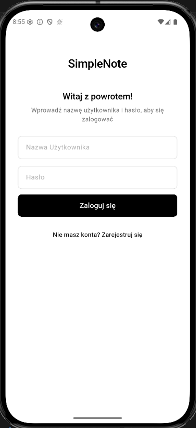

# SimpleNote Mobile

A Flutter mobile application acting as a client for [SimpleNote API](https://github.com/KrzysztofKantorski/Projekt_SimpleNote). Allows users to create and manage notes, scan text from photos, and interact with the community through comments and reactions.

## Technologies

* **Framework:** Flutter (Dart)
* **Architecture:** MVVM with Repository layer
* **State Management:** Provider (`ChangeNotifier`)
* **Navigation:** GoRouter
* **HTTP Client:** Dio
* **Authentication:** JWT (Access Token) + Refresh Token (HttpOnly Cookie)
* **Secure Storage:** flutter_secure_storage (Access Token), shared_preferences (onboarding)
* **OCR:** Google ML Kit Text Recognition
* **Testing:** flutter_test + Mockito

## Prerequisites

Before running the app locally, ensure you have the following installed:
* [Flutter SDK 3.x+](https://docs.flutter.dev/get-started/install)
* Android Studio or VS Code with the Flutter extension
* Android device (API 21+) or emulator
* [SimpleNote API](https://github.com/KrzysztofKantorski/Projekt_SimpleNote) running locally

## Getting Started

**1. Clone the repository**
```bash
git clone <https://github.com/KrzysztofKantorski/Projekt_SimpleNote>
cd simple-note
```

**2. Configure API URL**

In `lib/services/dio_client.dart`, set your server address:
```dart
baseUrl: 'http://10.0.2.2:PORT', // Android emulator → localhost
```

> `10.0.2.2` is the Android emulator's alias for the host machine's localhost.
> For a physical device, use your computer's local IP address instead.
> The port number is printed in the console after running `dotnet run`.

**3. Install dependencies**
```bash
flutter pub get
```

**4. Run the app**
```bash
flutter run
```

## Architecture

The project follows the **MVVM** pattern with an additional Repository layer:

```
API  →  Service  →  Repository  →  ViewModel  →  View
```

* **View** — displays data, listens for events
* **ViewModel** — handles view logic
* **Repository** — abstraction over the service layer, enables mocking in tests
* **Service** — wraps API calls


```
lib/
├── main.dart                  # DI configuration
├── app_router.dart            # GoRouter configuration
├── models/                    # Data models (JSON ↔ Dart)
├── services/                  # HTTP layer (Dio)
├── repositories/              # Abstractions over services
├── viewmodels/                # App state
├── views/                     # Screens
├── components/                # Reusable widgets
└── theme/                     # App theme
```

## App screens

**Login view**


